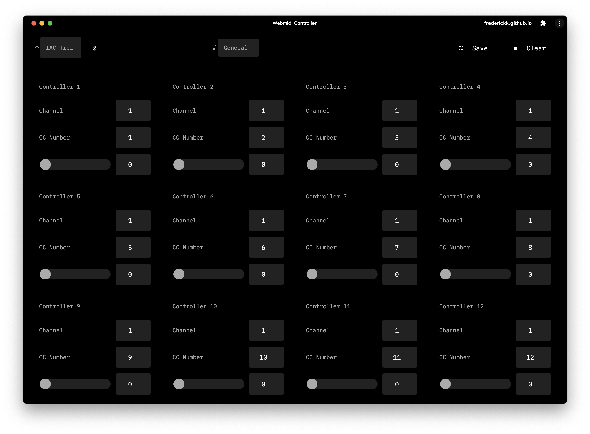
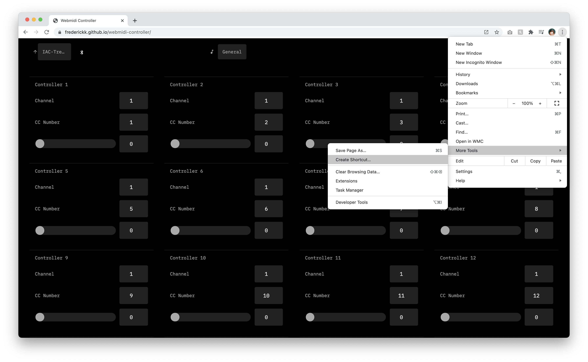

Xn Controllerbank<sup>[1](#_1)</sup>
===

### Sixteen or more or less controllers, Web MIDI over USB and maybe Bluetooth


- [General](https://frederickk.github.io/xn-controllerbank) blank slate, control what you want.
- [0-Coast](https://frederickk.github.io/xn-controllerbank/no-coast) review [manual](http://www.makenoisemusic.com/content/manuals/0-coast_manual.pdf) for details
- [OP-Z](https://frederickk.github.io/xn-controllerbank/op-z) review [guide](https://teenage.engineering/guides/op-z/midi) for details
- *[Eyesy](https://frederickk.github.io/xn-controllerbank/eyesy) review [repo](https://github.com/Lcchy/Eyesy_for_fates) or follow [thread](https://llllllll.co/t/critter-guitari-video-synth-eyesy-for-fates-updated/) for details. (untested)*



---

If you use Chrome, save [site](https://frederickk.github.io/xn-controllerbank) as an ["independent" app](https://support.google.com/chrome_webstore/answer/3060053?hl=en)

- Open Chrome.
- Navigate to the [site](https://frederickk.github.io/xn-controllerbank)
- At the top right, click **More**.
- Click **More Tools**.
- Click **Create shortcut**.
- Enter a name for the shortcut and click **Create**.



---

### Roadmap-ish

This was really just a cludge to solve a quick problem and an excuse to experiment with [LitElements](https://lit-element.polymer-project.org/). However, if I were to make updates here's where I would start.

- Ensure/support offline access
- Ability to upload custom device templates
- Save and recall number of controllers
- Change type of message sent (e.g. more than just CC messages)
- Define adjust details (e.g. min, max, etc.)

---

### Develop

```
$ npm run dev
```

Build

```
$ npm run build
```

Deploy

```
$ npm run deploy
```

---

<sup id="_1">1</sup> The name is an homage to the great [16n Faderbank](https://github.com/16n-faderbank/16n).
