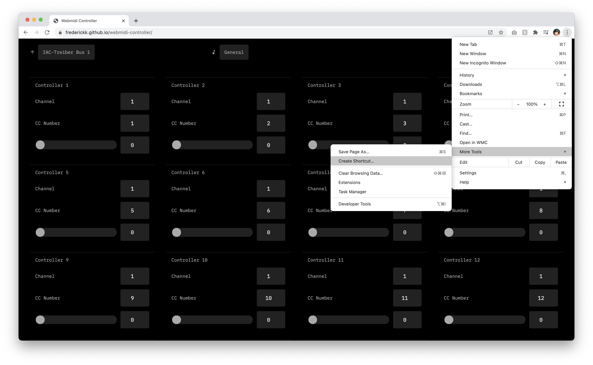

WebMidi Controller
===

### Control all the things via WebMidi.


- [General](https://frederickk.github.io/webmidi-controller) blank slate, control what you want.
- [0-Coast](https://frederickk.github.io/webmidi-controller/no-coast) review [manual](http://www.makenoisemusic.com/content/manuals/0-coast_manual.pdf) for details
- [Eyesy](https://frederickk.github.io/webmidi-controller/eyesy) review [repo](https://github.com/Lcchy/Eyesy_for_fates) or follow [thread](https://llllllll.co/t/critter-guitari-video-synth-eyesy-for-fates-updated/) for details.
- [OP-Z](https://frederickk.github.io/webmidi-controller/op-z) review [guide](https://teenage.engineering/guides/op-z/midi) for details


---

If you use Chrome, save [site](https://frederickk.github.io/webmidi-controller) as an ["independent" app](https://support.google.com/chrome_webstore/answer/3060053?hl=en)

- Open Chrome.
- Navigate to the [site](https://frederickk.github.io/webmidi-controller)
- At the top right, click **More**.
- Click **More Tools**.
- Click **Create shortcut**.
- Enter a name for the shortcut and click **Create**.



---

Develop

```
$ npm run dev
```

Build

```
$ npm run build
```

Deploy

```
$ npm run deploy
```
