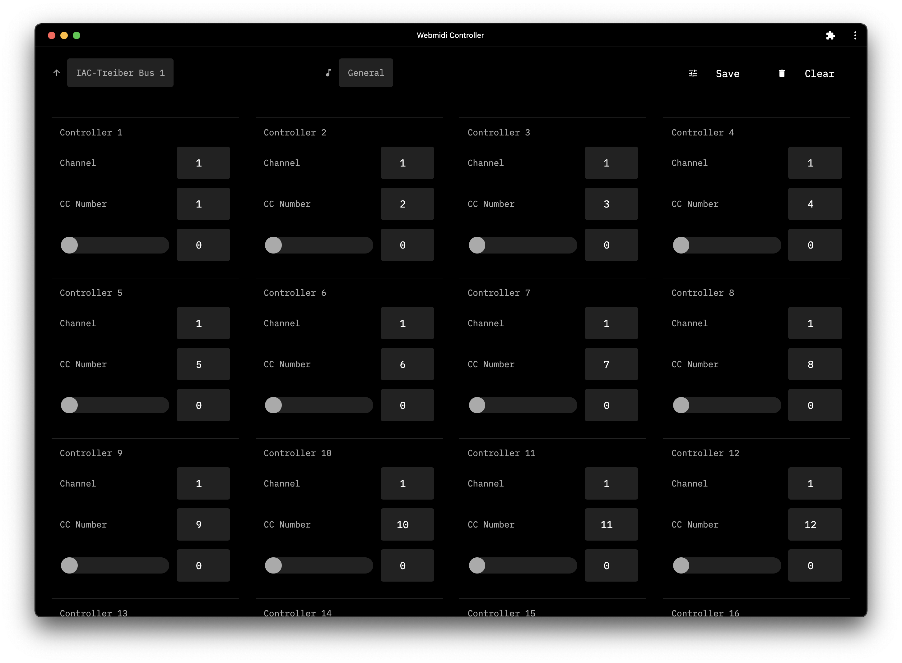

WebMidi Controller
===

[frederickk.github.io/webmidi-controller](https://frederickk.github.io/webmidi-controller)



---

Develop

```
$ npm run start
```

Build

```
$ npm run build
```

Deploy

```
$ npm run deploy
```
